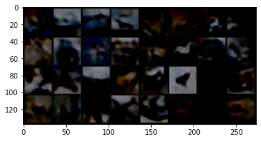
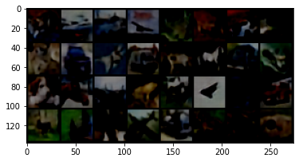

# VQ-VAE 

in Pytorch with pytorch-lightning & wandb

{ [paper](https://arxiv.org/pdf/1711.00937.pdf) }
{ code : [refer1](https://github.com/deepmind/sonnet/tree/master),
[refer2](https://github.com/zalandoresearch/pytorch-vq-vae),
[refer3](https://github.com/anantzoid/Conditional-PixelCNN-decoder),
[refer4](https://github.com/j-min/PixelCNN)}
{ deploy : [flask]() }

CiFar10을 기본 베이스 데이터셋으로 하여 학습하였습니다.

기본적인 Model 구조는 DeepMind을 따라 CNN with residual block based E/Decoder로 구현하였습니다.

추가적으로 PixelCNN Decoder을 통한 Sampler을 시도 중입니다

|epoch1|epoch31|
|---|---|
|||


## Env
```
pip install -r requirements.txt
```
## Run
### Train
```
VQ-VAE.ipynb
```

#### Train Log (including pic)
[wandb](https://wandb.ai/nemod-leo/VQ-VAE/runs/tlwp9uqp?workspace=user-nemod-leo)

### Test
```
VQ-VAE_Test.ipynb
```


## pretrained Model
```./result/ckpt/```
